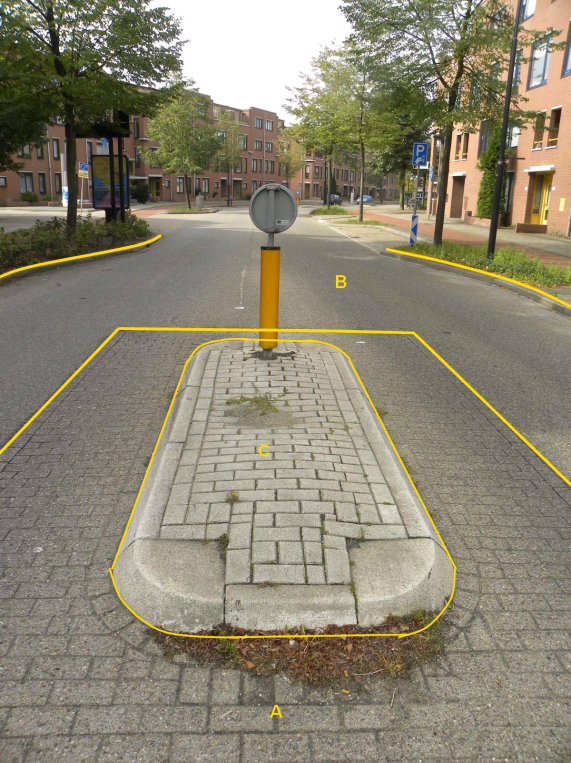
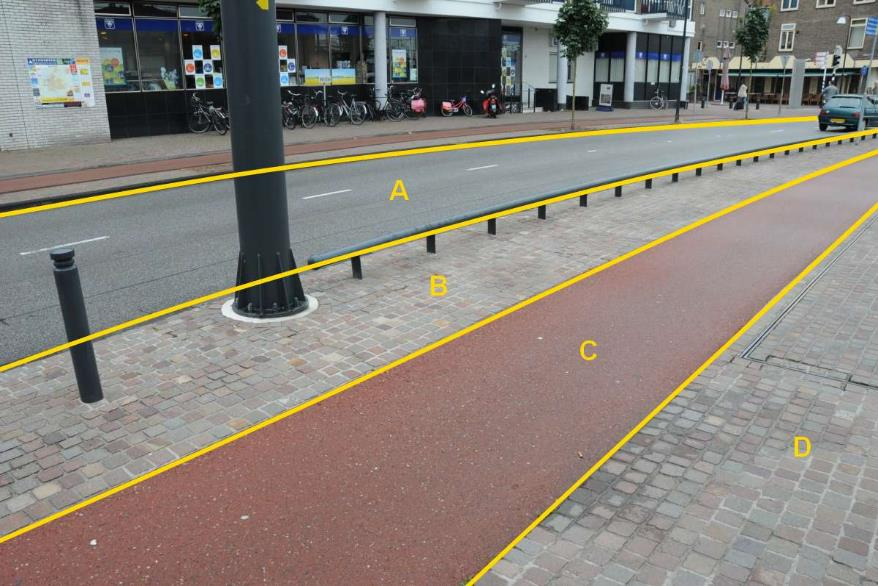

# OndersteunendWegdeel

**Definitie**

Een deel van de weg dat niet primair bedoeld is voor gebruik door het verkeer.

## inwinningsregels

### BGT

Bron: [Gegevenscatalogus BGT 1.2](https://docs.geostandaarden.nl/imgeo/catalogus/bgt/#objectafbakening-ondersteunendwegdeel)

#### Indeling

Dit object kent een onderverdeling in de typen verkeerseiland en berm. Berm
kent als fysiek voorkomen de verschillende verhardingssoorten en
groenvoorziening.

#### Regels voor opname

In de regel is dit object scherp begrensd met het aanliggende wegdeel door
bijvoorbeeld een band of de kant van de verharding. Als een berm bestaat uit
een deel verhard en een deel begroeid, ontstaan er voor de BGT twee objecten
OndersteunendWegdeel.

De niet-wegdeel begrenzing van een begroeide berm met een aanliggend
begroeid terrein zal niet altijd even duidelijk herkenbaar zijn. Als
begrenzing hanteert men dan een herkenbare overgang met een ander gewas of
een ander maairegime.

Bij een naast een wegdeel liggend waterdeel geldt dat als de afstand tussen
wegdeel en kant insteek \> 30 cm bedraagt, het deel daartussen als berm
wordt opgenomen. Mogelijke waterbegrenzingen staan beschreven bij Waterdeel.

De kruinlijn moet bij het ondersteunend wegdeel worden opgenomen indien de
helling een verhouding heeft van verticaal:horizontaal van 1:4 of steiler en
het hoogteverschil \>1m bedraagt. Eén van de zijden van het ondersteunend
wegdeel valt altijd samen met de kruinlijn, zijnde bovenkant talud. De
coördinaten van de kruinlijn zijn identiek met die van de objectbegrenzing
ter plaatse. Het gedeelte van een object dat op het talud ligt is altijd een
apart begrensd vlak ten opzichte van het deel van het object dat niet op het
talud ligt.

Als er meer dan een objecttype op een talud ligt, bevat alleen het hoogst
gelegen object een kruinlijngeometrie. De coördinaten van de kruinlijn zijn
identiek aan de coördinaten van de objectbegrenzing die samenvalt met de
kruinlijn.

### IMGeo

Bron: [Gegevenscatalogus IMGeo 2.2](https://docs.geostandaarden.nl/imgeo/catalogus/imgeo/#ondersteunend-wegdeel)

Grasklinkers liggen soms naast een wegdeel in de berm. Het betreffende vlak
vormt dan een afzonderlijk ondersteunend wegdeel. Wanneer een berm bestaat
uit een deel gras en een deel grasklinkers zijn dat twee verschillende
objecten -ondersteunend wegdeel- voor IMGeo/BGT; berm met als fysiek
voorkomen respectievelijk groenvoorziening gras en half verhard
grasklinkers.

## functie

**Definitie**

Specificatie van de functie van het ondersteunend wegdeel.

### verkeerseiland

**Definitie**

Ondersteunend wegdeel van beperkte omvang, uitgevoerd als verhoging of
wegmarkering, dat wordt omsloten door wegdelen en ten doel heeft verkeersstromen
te scheiden.

**Verplicht?**

Ja, verplichte inhoud BGT.

**Voorbeeld**

C:

| *OndersteunendWegdeel*   | *Attribuutwaarde* | *Opmerkingen* |
|--------------------------|-------------------|---------------|
| typeOndersteunendWegdeel | Verkeerseiland    |               |
| fysiekVoorkomen          | Open verharding   |               |
| relatieveHoogteligging   | 0                 |               |

A: Wegdeel, Rijbaan: Lokale weg, Open verharding.

B: Wegdeel, Rijbaan: Lokale weg, Gesloten verharding.

### berm

**Definitie**

Een strook grond langs een weg of spoorweg.

**Verplicht?**

Ja, verplichte inhoud BGT.

**Voorbeeld**

*Het ondersteunend wegdeel Berm kent dezelfde waarden voor fysiek voorkomen als
geldt voor Wegdeel, aangevuld met de classificatie groenvoorziening zoals
voorkomt bij Begroeid terreindeel.*

*Niet van al deze mogelijke classificaties zijn fotovoorbeelden opgenomen.*

B:

| **OndersteunendWegdeel** | **Attribuutwaarde** | **Opmerkingen** |
|--------------------------|---------------------|-----------------|
| functie                  | berm                |                 |
| Fysiek voorkomen         | open verharding     |                 |
| relatieveHoogteligging   |  0                  |                 |

A: Wegdeel, Rijbaan: Lokale weg, Gesloten verharding.

C: Wegdeel, Fietspad, Wegdeel, Gesloten verharding.

D: Wegdeel, Voetpad, Open verharding.

B:

| *OndersteunendWegdeel*   | *Attribuutwaarde* | *Opmerkingen* |
|--------------------------|-------------------|---------------|
| typeOndersteunendWegdeel | Berm              |               |
| fysiekVoorkomen          | onverhard         |               |
| relatieveHoogteligging   | 0                 |               |

C:

| *OndersteunendWegdeel*   | *Attribuutwaarde* | *Opmerkingen* |
|--------------------------|-------------------|---------------|
| typeOndersteunendWegdeel | Berm              |               |
| fysiekVoorkomen          | groenvoorziening  |               |
| relatieveHoogteligging   | 0                 |               |

A: Wegdeel, Rijbaan: Lokale weg, Gesloten verharding.

## fysiekvoorkomen

**Definitie**

Mate waarin het ondersteunend wegdeel al of niet verhard is.

**Toelichting**
In IMGeo kunnen bij ondersteunend wegdeel alle fysieke voorkomens worden
toegekend zoals bij wegdeel of een deel van de plustypen van begroeid
terreindeel groenvoorziening.

### gesloten verharding

**Definitie**

Verharding bestaande uit een materiaal dat niet verwijderbaar is zonder
definitieve destructie, zoals bijvoorbeeld bitumen, cement of kunststof.

**Verplicht?**

Ja, verplichte inhoud BGT.

**Voorbeeld**

Zie fysiekvoorkomen van Wegdeel.

#### asfalt

**Definitie**

Gesloten verharding bestaande uit asfaltbeton of andere met bitumen gebonden
materialen.

**Verplicht?**

Nee, optionele inhoud IMGeo.

**Voorbeeld**

Zie fysiekvoorkomen van Wegdeel.

#### cementbeton

**Definitie**

Gesloten verharding bestaande uit gewapend of ongewapend beton.

**Verplicht?**

Nee, optionele inhoud IMGeo.

**Voorbeeld**

Zie fysiekvoorkomen van Wegdeel.

### open verharding

**Definitie**

Verharding gevormd door in verband aangebrachte elementen van beperkte
afmetingen, zoals bijvoorbeeld klinkers en tegels.

**Verplicht?**

Ja, verplichte inhoud BGT.

**Voorbeeld**

Zie fysiekvoorkomen van Wegdeel.

#### betonstraatstenen

**Definitie**

Verharding gemaakt van betonstraatstenen. Straatsteen die als goedkope
vervanging van de gebakken klinkers is ontwikkeld.

**Verplicht?**

Nee, optionele inhoud IMGeo.

**Voorbeeld**

Zie fysiekvoorkomen van Wegdeel.

#### gebakken klinkers

**Definitie**

Verharding gemaakt van straatbakstenen. Gebakken klinkers worden voornamelijk
geproduceerd uit grondstof van eigen bodem; de beddingen van onze rivieren.

**Verplicht?**

Nee, optionele inhoud IMGeo.

**Voorbeeld**

Zie fysiekvoorkomen van Wegdeel.

#### tegels

**Definitie**

Bestrating van tegels, een platte vaak vierkante betonnen steen; veelal gebruikt
voor trottoirbestrating.

**Verplicht?**

Nee, optionele inhoud IMGeo.

**Voorbeeld**

Zie fysiekvoorkomen van Wegdeel.

#### sierbestrating

**Definitie**

Bestrating, uitgevoerd in verschillende bestratingsverbanden en -materialen, of
in een sierverband, die vooral wordt toegepast uit esthetische overwegingen.

**Verplicht?**

Nee, optionele inhoud IMGeo.

**Voorbeeld**

Zie fysiekvoorkomen van Wegdeel.

#### beton element

**Definitie**

Geprepareerde elementen van beton zoals, trottoirbanden, opsluitbanden en
stelconplaten.

**Verplicht?**

Nee, optionele inhoud IMGeo.

**Voorbeeld**

Zie fysiekvoorkomen van Wegdeel.

### half verhard

**Definitie**

Verharding bestaande uit een door verdichting gebonden materiaal, of
onsamenhangend materiaal.

**Verplicht?**

Ja, verplichte inhoud BGT.

**Voorbeeld**

Zie fysiekvoorkomen van Wegdeel.

#### grasklinkers

**Definitie**

Elementenverharding bestaande uit elementen van beperkte afmetingen die ten
behoeve van de doorgroei van grassen en kruiden, zijn voorzien van openingen of
met tussenruimten aangebracht.

**Verplicht?**

Nee, optionele inhoud IMGeo.

**Voorbeeld**

Zie fysiekvoorkomen van Wegdeel.

#### schelpen

**Definitie**

Ongebonden verharding bestaande uit schelpenmateriaal.

**Verplicht?**

Nee, optionele inhoud IMGeo.

**Voorbeeld**

Zie fysiekvoorkomen van Wegdeel.

#### puin

**Definitie**

Puin is afvalmateriaal dat bestaat uit losse brokstukken, grotendeels bestaande
uit stenen en beton, van gesloopte of ingestorte gebouwen, viaducten, bruggen en
andere objecten.

**Verplicht?**

Nee, optionele inhoud IMGeo.

**Voorbeeld**

Zie fysiekvoorkomen van Wegdeel.

#### grind

**Definitie**

Ongebonden verharding bestaande uit kiezelmateriaal, waarvan de stenen in
doorsnede variëren van 1 tot 5 cm.

**Verplicht?**

Nee, optionele inhoud IMGeo.

**Voorbeeld**

Zie fysiekvoorkomen van Wegdeel.

#### gravel

**Definitie**

Gravel is een ondergrond van gemalen baksteen die veel wordt gebruikt bij tennis
en ook wel op atletiekbanen.

**Verplicht?**

Nee, optionele inhoud IMGeo.

**Voorbeeld**

Zie fysiekvoorkomen van Wegdeel.

### onverhard

**Definitie**

Wegdelen waar geen verharding of aaneengesloten vegetatie aanwezig is.

**Verplicht?**

Ja, verplichte inhoud BGT.

**Voorbeeld**

Zie fysiekvoorkomen van Wegdeel.

#### boomschors

**Definitie**

Onverhard met als deklaag boomschors.

**Verplicht?**

Nee, optionele inhoud IMGeo.

**Voorbeeld**

Zie fysiekvoorkomen van Wegdeel.

#### zand

**Definitie**

Onverhard met als deklaag zand.

**Verplicht?**

Nee, optionele inhoud IMGeo.

**Voorbeeld**

Zie fysiekvoorkomen van Wegdeel.

### groenvoorziening

**Definitie**

Terreindeel met aangelegde beplanting, meestal gras, heesters of struiken.

**Verplicht?**

Ja, verplichte inhoud BGT.

**Voorbeeld**

Zie fysiekvoorkomen van BegroeidTerreindeel.

#### bosplantsoen

**Definitie**

Opgaande beplanting van houtachtige gewassen die struikvormend en/of boomvormend
zijn. De soorten zijn als bosplantsoen opgekweekt en aangeplant.De beplanting
kan open of gesloten zijn en bestaat vaak uit inheemse soorten. Onderscheidt
zich van heesters omdat de sierkenmerken niet voorop staan.

**Verplicht?**

Nee, optionele inhoud IMGeo.

**Voorbeeld**

Zie fysiekvoorkomen van BegroeidTerreindeel.

#### gras- en kruidachtigen

**Definitie**

(Grond met) een laagblijvende, aaneengesloten kruidachtige vegetatie.

**Verplicht?**

Nee, optionele inhoud IMGeo.

**Voorbeeld**

Zie fysiekvoorkomen van BegroeidTerreindeel.

#### planten

**Definitie**

Beheerde niet nader gespecificeerde beplanting van groenvak in de openbare
ruimte.

**Verplicht?**

Nee, optionele inhoud IMGeo.

**Voorbeeld**

Zie fysiekvoorkomen van BegroeidTerreindeel.

#### struikrozen

**Definitie**

Beheerde beplanting van groenvak in de openbare ruimte, zijnde in struikvorm
groeiende rozen.

**Verplicht?**

Nee, optionele inhoud IMGeo.

**Voorbeeld**

Zie fysiekvoorkomen van BegroeidTerreindeel.

#### heesters

**Definitie**

Beplanting van houtige gewassen die struikvormend zijn en die al dan niet een
gesloten geheel vormen. Het accent ligt op de sierwaarde, de beplanting kan uit
één soort of uit meerdere soorten bestaan. Onder de heesters kan een houtachtige
of kruidachtige onderbegroeiing aanwezig zijn. Het oppervlak met struikachtige
gewassen is meer dan 50% van de totale oppervlakte van het vak.

**Verplicht?**

Nee, optionele inhoud IMGeo.

**Voorbeeld**

Zie fysiekvoorkomen van BegroeidTerreindeel.

#### bodembedekkers

**Definitie**

Beheerde beplanting van groenvak in de openbare ruimte, zijnde bodembedekkers.

**Verplicht?**

Nee, optionele inhoud IMGeo.

**Voorbeeld**

Zie fysiekvoorkomen van BegroeidTerreindeel.
