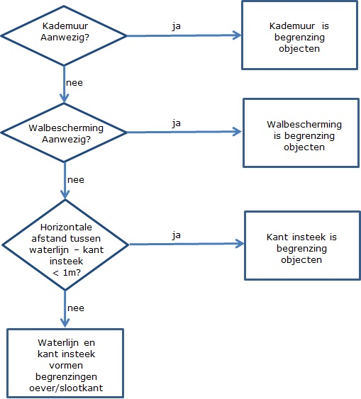
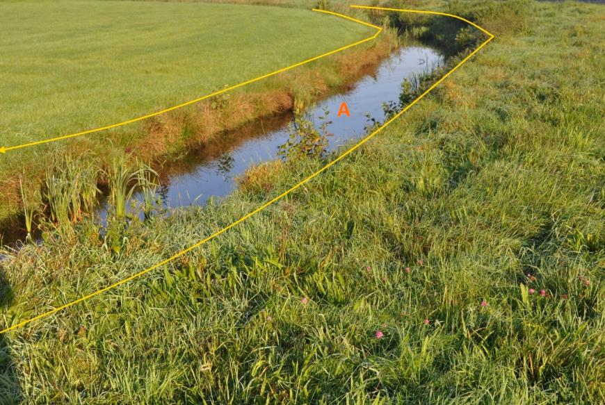
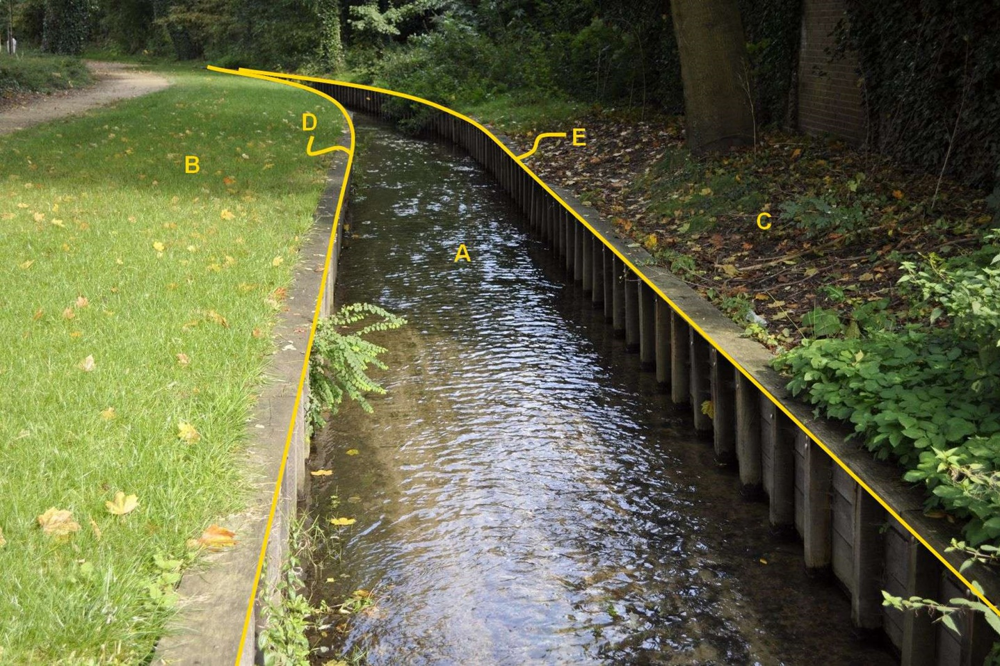
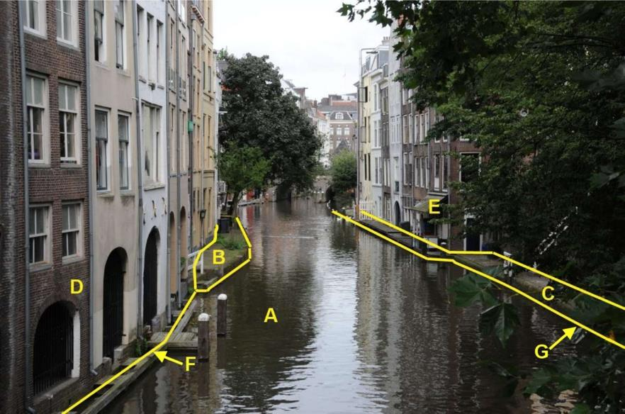
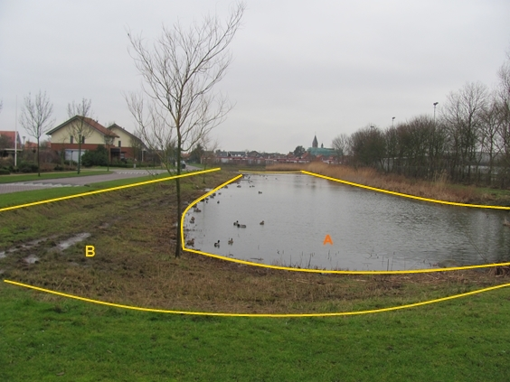
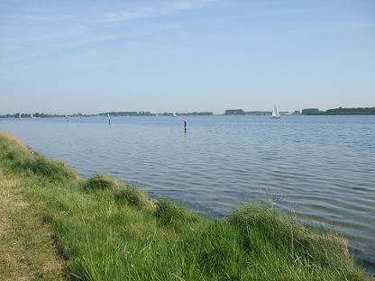
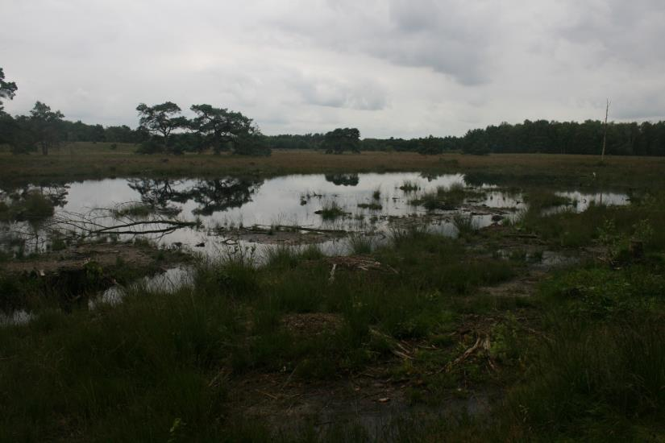
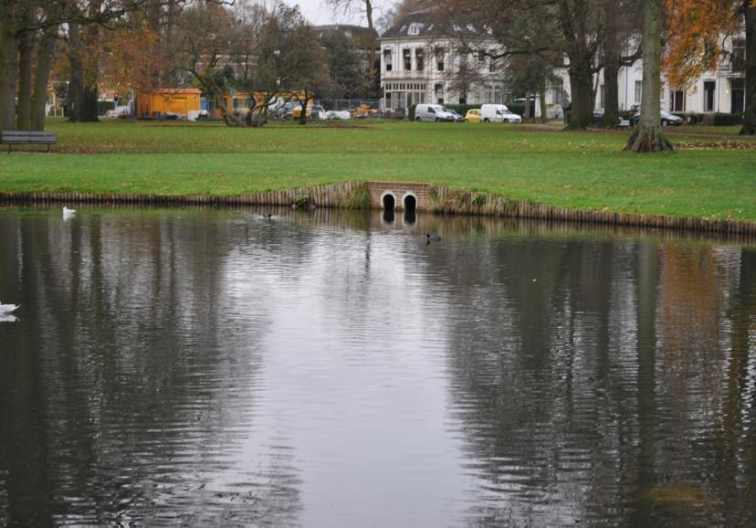
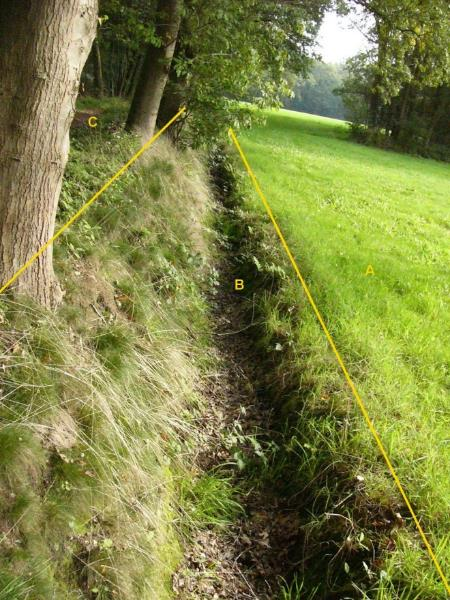

Waterdeel
=========

**Definitie**

Kleinste functioneel onafhankelijk stukje water met gelijkblijvende, homogene
eigenschappen en relaties dat er binnen het objecttype Water van NEN 3610 wordt
onderscheiden en dat permanent met water bedekt is.

Inwinningsregels
----------------

### BGT

Bron: [Gegevenscatalogus BGT
1.2](https://docs.geostandaarden.nl/imgeo/catalogus/bgt/#objectafbakening-waterdeel-ondersteunendwaterdeel)

>   De volgende paragrafen beschrijven op welke wijze land en water zijn
>   gescheiden in de BGT.
>   
>   **Algemeen**
>   
>   De BGT kent vier typen waterdeel: zee; waterloop; watervlakte; greppel,
>   droge sloot. En twee typen ondersteunend waterdeel: oever, slootkant; slik.
>   
>   De kruinlijngeometrie wordt bij het ondersteunend waterdeel niet opgenomen.
>   Impliciet is de – niet-waterbegrenzing – van een oever altijd de hoogste
>   kant.
>   
>   Voor de begrenzing van land en zee maakt de BGT onderscheid in de begrenzing
>   langs de Noordzee enerzijds en die langs de Waddenzee en de Zuidwestelijke
>   delta in Zeeland en Zuid-Holland anderzijds.
>   
>   Onder waterlopen vallen rivieren, kanalen, beken, sloten en grachten.
>   
>   Watervlakten zijn meren, plassen, vennen en vijvers. Ook havens vallen in de
>   regel hieronder.
>   
>   Greppels en droge sloten hebben een functie in de waterhuishouding.
>   
>   Oevers en slootkanten zijn de delen die enerzijds begrensd worden door de
>   waterlijn en anderzijds door een kant insteek.
>   
>   Slikken zijn bij laagwater droogvallende delen. Zij komen uitsluitend voor
>   in de Waddenzee en in de Zuidwestelijke delta.
>   
>   In het algemeen geldt dat zichtbare topografie altijd als begrenzing
>   voorkomt, in de beschreven situaties aangevuld met niet of niet-altijd
>   zichtbare topografische begrenzingen.
>   
>   **Noordzee**
>   
>   Voor de begrenzing van terrein en water langs de Noordzee gebruikt de BGT de
>   UNCLOS-basislijn. Deze basislijn valt onder verantwoording van de Dienst der
>   Hydrografie van het ministerie van Defensie. Deze dienst voert deze taak uit
>   op basis van het Zeerechtverdrag van de Verenigde Naties uit 1982 "United
>   Nations Convention on the Law of the Sea (UNCLOS)". Dit verdrag regelt de
>   rechten die staten hebben op zee en de manier waarop buurstaten deze rechten
>   begrenzen. Centraal in dit verdrag staat de basislijn, die het verloop van
>   de kust definieert.
>   
>   De Nederlandse basislijn is een combinatie van normale basislijnen en rechte
>   (‘getrokken’) basislijnen. In tegenstelling tot de normale basislijn, zijn
>   de rechte basislijnen onveranderlijk en bij Nederlandse wet vastgesteld. De
>   rechte basislijnen vormen de af­sluiting van zeegaten, en daarmee de
>   begrenzing tussen de territoriale zee en de binnenwateren.
>   
>   Sluit de basislijn een waterdeel af zoals onder meer van de Westerschelde,
>   Nieuwe Waterweg en Waddenzee, dan vormt de basislijn de begrenzing van dat
>   waterdeel met de Noordzee.
>   
>   **Actualiteit**
>   
>   Een of enkele keren per jaar publiceert de Dienst der Hydrografie een nieuwe
>   UNCLOS-basislijn. De dienst maakt gebruikers attent op deze wijzigingen,
>   onder meer via de [eigen
>   website](https://www.defensie.nl/onderwerpen/hydrografie/) en via een
>   mailing per e-mail.
>   
>   **Strand**
>   
>   Langs de Noordzee bezit het onbegroeid terreindeel grenzend aan de basislijn
>   het fysiek voorkomen ‘zand’.
>   
>   Aan de ‘landzijde’ wordt het strand altijd begrensd door zichtbare
>   topografie, zoals de overgang naar de duinen bestaande uit een hek of
>   duinvoet. In het geval een kunstmatige aangelegde waterkering aanwezig is,
>   zoals bij de Hondsbossche Zeewering, bestaat de begrenzing uit kademuur of
>   walbescherming.
>   
>   **Waddenzee en Zuidwestelijke delta**
>   
>   In deze wateren is altijd een kunstmatig aangelegde waterkering aanwezig in
>   de vorm van een kademuur of walbescherming. Deze vormen altijd een
>   begrenzing voor de BGT.
>   
>   Daarnaast worden in deze wateren peilingen verricht voor het Lowest
>   Astronomical Tide (LAT). Als de ligging daarvan beschikbaar is voor de BGT
>   vormt het de scheiding tussen het waterdeel en het ondersteunend waterdeel
>   type slik. Ontbreekt het LAT dan vormt de kunstmatige waterkering de
>   scheiding tussen terrein en water.
>   
>   **Rivieren**
>   
>   In de BGT komt bij rivieren of een begrenzing voor in de vorm van een
>   kademuur of walbescherming, of een oever. Van nature komt er een variabel
>   peil voor. In de grote, bevaarbare rivieren hanteert Rijkswaterstaat hier
>   een peil met de naam Overeengekomen Lage Rivierwaterstand (OLR). Als een
>   presentatie van dit peil beschikbaar is, vormt het voor de BGT de begrenzing
>   van waterdeel met ondersteunend waterdeel type oever. Bij het ontbreken van
>   het OLR vormt het laagste streefpeil, eveneens onder verantwoording van
>   Rijkswaterstaat, deze begrenzing. Is de ligging van een peil niet
>   beschikbaar voor de BGT dan vormt de kunstmatige waterkering de scheiding
>   tussen terrein en water.
>   
>   **Meren**
>   
>   Bij meren komen kunstmatig aangelegde waterkeringen voor in de vorm van een
>   kademuur of walbescherming, soms is er sprake van een oever. Als een
>   kunstmatige waterkering aanwezig is in de vorm van een kademuur of
>   walbescherming vormt dit de begrenzing van terrein en water. Bij het
>   ontbreken daarvan vormt het object begrensd door waterlijn en de bovenzijde
>   van een herkenbare insteek een ondersteunend waterdeel type oever/slootkant.
>   
>   In meren wordt een streefpeil beheerd door bemalen en/of spuien. Als de
>   ligging van een peil bekend is en de horizontale afstand tussen een
>   herkenbare insteek bedraagt 1m of meer dan ontstaat in de BGT een
>   ondersteunend waterdeel van het type oever. Waar sprake is van meerdere
>   streefpeilen, wordt uitgegaan van het laagste niveau of ondergrenspeil.
>   
>   **Overige waterlopen en -vlakken**
>   
>   Hier geldt onderstaand stroomdiagram. Als kant water de begrenzing van
>   objecten vormt, geldt dat dit een presentatie is van het laagst mogelijke
>   streefpeil ter plaatse. Als de horizontale afstand tussen waterlijn en de
>   bovenkant van een herkenbare insteek 1m of meer bedraagt dan ontstaat in de
>   BGT een ondersteunend waterdeel van het type oever/slootkant.
>
>   

### IMGeo

Bron: [Gegevenscatalogus IMGeo
2.2](https://docs.geostandaarden.nl/imgeo/catalogus/imgeo/#waterdeel-en-waterinrichtingselement)

>   In IMGeo zijn waterlopen en watervlakten nader te classificeren.
>   
>   In IMGeo kunnen inrichtingselementen, die op en in het water voorkomen,
>   worden opgenomen met het objecttype waterinrichtingselement.
>   
>   Van remmingswerk, geleidewerk en vuilvang wordt de lijngeometrie opgenomen
>   waarbij voor remmingswerk en geleidewerk geldt dat deze worden ingewonnen
>   aan die zijde waar de scheepvaart langs vaart.
>   
>   Van betonning, meerpaal en hoogtemerk wordt de puntgeometrie opgenomen.
>   
>   Het objecttype functioneel gebied kent op het gebied van de waterhuishouding
>   de classificaties ‘kering’ als BGT inhoud, en in het optionele deel
>   ‘waterbergingsgebied’ en ‘infrastructuur waterstaatswerken’. Zie de
>   paragraaf over functioneel gebied voor meer informatie. Functionele gebieden
>   bevatten geen plaatsbepalingspunten.

type
----

**Definitie**

Specificatie van het soort Water.

### zee

**Definitie**

Uitgestrekt oppervlak zout water.

**Verplicht?**

Ja, verplichte inhoud BGT.

**Voorbeeld**

C:

| **Waterdeel**          | **Attribuutwaarde** | **Opmerkingen** |
|------------------------|---------------------|-----------------|
| type                   | zee                 |                 |
| relatieveHoogteligging |  0                  |                 |

A: begroeid terreindeel, duin.

B: onbegroeid terreindeel, zand.

### waterloop

**Definitie**

Een voor de waterbeheersing bestemde geul die meestal permanent water bevat
(zoals rivier, kanaal, beek, sloot, gracht).

**Verplicht?**

Ja, verplichte inhoud BGT.

**Voorbeeld**

D:

| **Waterdeel**          | **Attribuutwaarde** | **Opmerkingen** |
|------------------------|---------------------|-----------------|
| type                   | waterloop           |                 |
| relatieveHoogteligging |  0                  |                 |

A: wegdeel, rijbaan: lokale weg, open verharding

B en E: ondersteunend waterdeel, oever/slootkant.

C: scheiding, kademuur.

Wegdeel met berm en ondergronds waterdeel

Duikers vormen geen inhoud BGT.

F: Het niet zichtbare waterdeel in duiker is géén BGT-inhoud.

#### rivier

**Definitie**

Het water, dat ten atmosferische neerslag op hellende terreinen valt, vloeit,
voor zover het niet verdampt of door planten wordt opgenomen, tezamen tot een
waterloop en stroomt naar laaggelegen streken. Zulk een natuurlijke afvloeiing
heet een rivier.

**Verplicht?**

Nee, optionele inhoud IMGeo.

**Voorbeeld**

| **Waterdeel**          | **Attribuutwaarde** | **Opmerkingen** |
|------------------------|---------------------|-----------------|
| type                   | waterloop: rivier   |                 |
| relatieveHoogteligging |                     |                 |

#### sloot

**Definitie**

Algemene benaming voor een waterloop van beperkte breedte die stilstaand of
slechts langzaam stromend water bevat.

**Verplicht?**

Nee, optionele inhoud IMGeo.

**Voorbeeld**

A:

| **Waterdeel**          | **Attribuutwaarde** | **Opmerkingen** |
|------------------------|---------------------|-----------------|
| type                   | waterloop: sloot    |                 |
| relatieveHoogteligging |                     |                 |

#### kanaal

**Definitie**

Een gegraven grote waterloop die dient voor scheepvaart en/of watertransport.

**Verplicht?**

Nee, optionele inhoud IMGeo.

**Voorbeeld**

| **Waterdeel**          | **Attribuutwaarde** | **Opmerkingen** |
|------------------------|---------------------|-----------------|
| type                   | waterloop: kanaal   |                 |
| relatieveHoogteligging |                     |                 |

#### beek

**Definitie**

Een natuurlijke smalle waterloop zonder getij.

**Verplicht?**

Nee, optionele inhoud IMGeo.

**Voorbeeld**

A:

| **Waterdeel**          | **Attribuutwaarde** | **Opmerkingen** |
|------------------------|---------------------|-----------------|
| type                   | waterloop: beek     |                 |
| relatieveHoogteligging |                     |                 |

#### gracht

**Definitie**

Een gracht is een gegraven greppel met water, die hoofdzakelijk voorkomt in oude
steden.

**Verplicht?**

Nee, optionele inhoud IMGeo.

**Voorbeeld**

A:

| **Waterdeel**          | **Attribuutwaarde** | **Opmerkingen** |
|------------------------|---------------------|-----------------|
| type                   | waterloop: gracht   |                 |
| relatieveHoogteligging |                     |                 |

#### bron

**Definitie**

Grondwater dat op natuurlijke wijze uit het aardoppervlak tevoorschijn komt.

**Verplicht?**

Nee, optionele inhoud IMGeo.

**Voorbeeld**

Een afbeelding van een bron kunt u sturen aan: <imgeo@geonovum.nl>

| **Waterdeel**          | **Attribuutwaarde** | **Opmerkingen** |
|------------------------|---------------------|-----------------|
| type                   | waterloop: bron     |                 |
| relatieveHoogteligging |                     |                 |

### watervlakte

**Definitie**

Alle oppervlakken die vrij permanent met zoet water zijn bedekt. (zoals meer,
plas, ven, vijver).

**Verplicht?**

Ja, verplichte inhoud BGT.

**Voorbeeld**

A:

| **Waterdeel**          | **Attribuutwaarde** | **Opmerkingen** |
|------------------------|---------------------|-----------------|
| type                   | watervlakte         |                 |
| relatieveHoogteligging |  0                  |                 |

B: OndersteunendWaterdeel, Oever/slootkant

#### haven

**Definitie**

Een tot ligplaats van schepen geschikt, natuurlijk of gegraven waterbekken aan
zee of aan de oever van een rivier of binnenwater, dat beschutting biedt tegen
wind en golven.

**Verplicht?**

Nee, optionele inhoud IMGeo.

**Voorbeeld**

| **Waterdeel**          | **Attribuutwaarde** | **Opmerkingen** |
|------------------------|---------------------|-----------------|
| type                   | watervlakte: haven  |                 |
| relatieveHoogteligging |                     |                 |

#### meer, plas, ven, vijver

**Definitie**

Een massa stilstaand landoppervlaktewater.

**Verplicht?**

Nee, optionele inhoud IMGeo.

**Voorbeeld**

Meer

| **Waterdeel**          | **Attribuutwaarde**                  | **Opmerkingen** |
|------------------------|--------------------------------------|-----------------|
| type                   | watervlakte: meer, plas, ven, vijver |                 |
| relatieveHoogteligging |                                      |                 |

Plas

Ven

Vijver

OverigBouwwerk
==============

### greppel, droge sloot

**Definitie**

Een ten behoeve van de waterbeheersing gegraven geul die al dan niet met water
bedekt is.

**Verplicht?**

Ja, verplichte inhoud BGT.

**Voorbeeld**

P1060135

B:

| *Waterdeel*            | *Attribuutwaarde*   | *Opmerkingen* |
|------------------------|---------------------|---------------|
| type water             | Greppel/droge sloot |               |
| relatieveHoogteligging |  0                  |               |

A: begroeidterreindeel, grasland agrarisch

C: begroeidterreindeel, loofbos.

